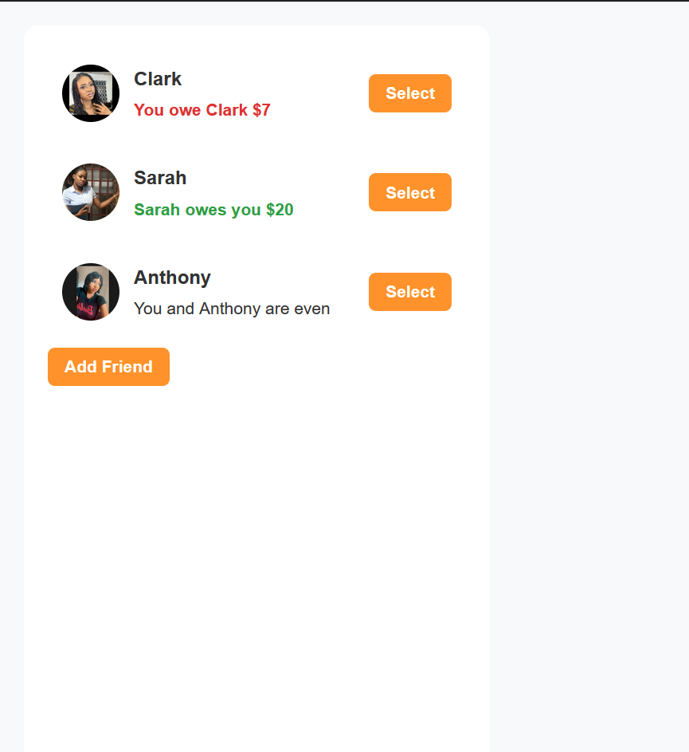
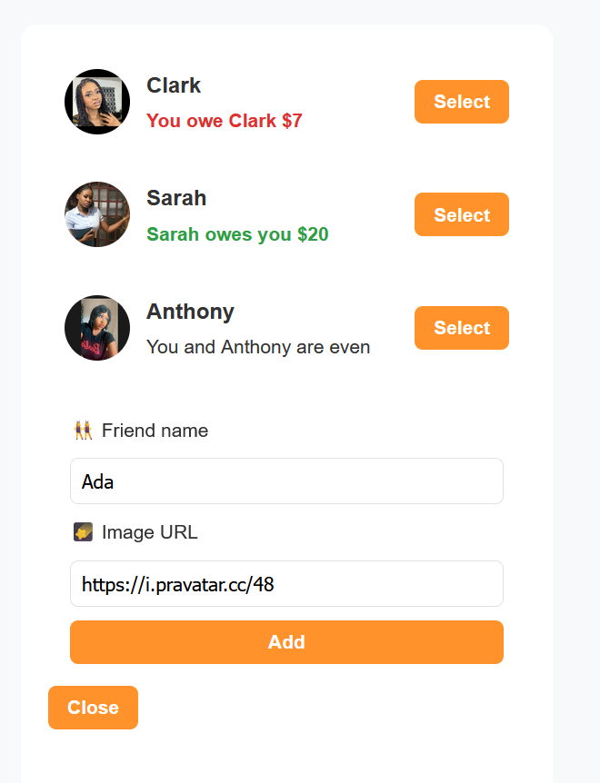
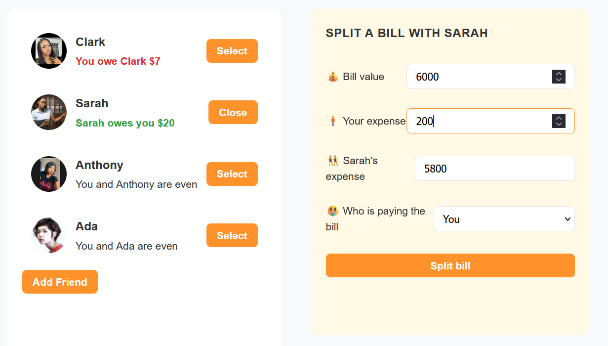

# 💸 Split Bill App

A modern and intuitive React application that helps you **split bills** with
your friends and track balances with ease. This project is ideal for practicing
state management in React, conditional rendering, form handling, and simple
arithmetic logic in a user-friendly interface.

## 🚀 Features

- ✅ Add friends with a custom avatar
- ✅ Select a friend to split a bill
- ✅ Input bill total, your contribution, and who paid
- ✅ Automatically calculates and updates who owes whom
- ✅ Friendly UI with visual cues (green for credit, red for debt)
- ✅ Cleanly designed and mobile-friendly

## 📸 Screenshots

| Friends List                                  | Add Friend Form                             | Split Bill Form                             |
| --------------------------------------------- | ------------------------------------------- | ------------------------------------------- |
|  |  |  |

## 🛠️ Installation

To get this project up and running locally:

```bash
# Clone the repository
git clone https://github.com/Miss-Marvis/eat-and-split


# Install dependencies
npm install

# Start the development server
npm run dev
```

🧱 Built With

    React

    Vite

     Plain CSS

📂 Project Structure EAT-And-Split/ ├── dist/ ├── node_modules/ ├── public/ │
└── vite.svg ├── screenshot/ │ ├── Screenshot1.png │ ├── Screenshot2.png │ └──
Screenshot3.png ├── src/ │ ├── assets/ │ │ └── images/ │ │ ├── react.svg │ │ ├──
Screenshot1.png │ │ ├── Screenshot2.png │ │ └── Screenshot3.png │ ├── App.css │
├── App.jsx │ ├── index.css │ └── main.jsx ├── .gitignore ├── eslint.config.js
├── index.html ├── package-lock.json ├── package.json ├── vite.config.js └──
README.md

🌐 Live Demo

🚀 Live on Netlify: https://bills-with-buddies.netlify.app/
